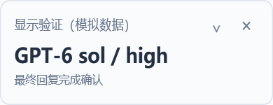

# Codex Model Advisor Router

A Windows companion that selects a GPT model and reasoning effort for tasks in Codex Desktop. Keep using the original composer; inspect routing and execution in a floating window or local web page.

**Jev selects. GPT answers and executes.** An independent community project, not an official OpenAI, TypeSafe or OpenCode product.

[中文](README.md) · [Installation and recovery](docs/INSTALL.md#english) · [Privacy](PRIVACY.md#english) · [Release notes](docs/RELEASE.md#english)

## What it does

- Automatic model/effort selection, with rules and suggestion modes available.
- One selection reused for tool continuations; new follow-ups evaluated separately.
- Optional, user-written context shared across conversations and registered project folders.
- Resizable window, tray and local dashboard showing conversation, model, effort and execution state.
- Local credentials, modes, updates and recovery. Jev abstention, timeout and invalid suggestions retain the incoming configuration.

```text
task + necessary context + optional project summary
                       ↓
                  Jev selection
                       ↓
         candidate and user-configuration checks
                       ↓
          GPT answers, uses tools and completes
                       ↓
              floating window / dashboard
```

## Quick start

Requires Windows x64, an installed and signed-in Codex Desktop, and your own [OpenCode Zen](https://opencode.ai/docs/en/zen/) key for Jev. GPT uses your existing Codex login; Jev access and terms are separate.

1. Download the Windows ZIP and `SHA256SUMS.txt` from this repository's **Releases**, verify, extract and open `Model-Advisor.vbs` (or `Install.cmd`). In the Chinese-language management window, click **安装并启动** (Install and start). Node.js is bundled; no separate Python or Node.js installation is needed.
2. Open Settings from the window or the [local settings page](http://127.0.0.1:18765/settings). Installation starts in rules mode.
3. Click the native key-window button and paste your OpenCode Zen API key in the Windows password dialog. The web page does not display the plaintext key. `Configure-Jev.cmd` also supports local entry.
4. Optionally add project context. Review outbound information, choose “Jev 自动选择” (automatic), grant consent and apply the mode.
5. Optionally run one connection check. Confirm your Codex conversation uses the local controller and its incoming configuration matches the baseline shown in Settings, then ask normally.

A connection check may make one Jev request; it does not poll automatically. Available model/effort pairs come from the local Codex catalog. The current settings and window interface use Chinese labels.

## Project context

Under “项目背景”, enter actual directories, **one full path per line**. Multiple folders share one summary and are edited, disabled or removed together.

```text
C:\Projects\shop-frontend
D:\Projects\shop-backend
```

Describe the stack, scope, file layout and checks in up to 2,000 characters. Preview the exact text, grant consent and save. The router does not scan project files.

Matching uses the conversation's working directory, including subdirectories. The most specific registered root wins; per-conversation settings take precedence. Unknown project identity means no project summary. Changes apply from the next user turn. Disabling stops future attachment, not information already sent.

## Modes and status

| Mode | Behavior |
| --- | --- |
| Jev automatic | Applies a valid Jev model/effort selection to eligible requests |
| Jev suggestions | Shows suggestions without applying them |
| Rules | Uses local rules and makes no Jev call |

Protected requests, including manual configuration overrides, retain their incoming selection. Jev failure or invalid suggestions also preserve incoming configuration without silently substituting rules.

**The Codex composer label may remain unchanged.** The [dashboard](http://127.0.0.1:18765/) distinguishes recommendations, request configuration, upstream completion and final-message attribution. Older conversations may retain an earlier provider; create a new conversation and check its routing if needed.



Move, resize or expand the window. Closing hides it while routing continues. Reopen from the tray, settings page or shortcut. Exiting the window does not disable routing. Images use simulated data.

## Updates, recovery and privacy

Wait for tasks to finish before updating and retain the previous version. Reopen `Model-Advisor.vbs` to access Settings, show the widget, restart or update. For uninstall, command-line management and rollback, see [installation and recovery](docs/INSTALL.md#english). Uninstallation restores only managed Codex settings.

Jev receives task text, necessary recent context and summaries you explicitly enable. Windows DPAPI encrypts the key for the current user. Summaries are stored as local, unencrypted JSON. See [privacy](PRIVACY.md#english).

## Development

Use Node.js 24; no npm production dependencies. `npm test` runs offline product checks without model keys. Native-window checks require an interactive Windows session.

| Directory | Responsibility |
| --- | --- |
| `src/` | Routing, Jev integration, context and local web UI |
| `scripts/` | Installation, management, windows and packaging |
| `skills/` | Codex management skill |
| `test/` | Offline product checks |
| `docs/` | Guides and simulated displays |

See [build instructions](docs/BUILD.md#english). Distribution is GitHub source plus Windows ZIP, not an npm package.

[MIT License](LICENSE) · [Third-party notices](THIRD_PARTY_NOTICES.md)
